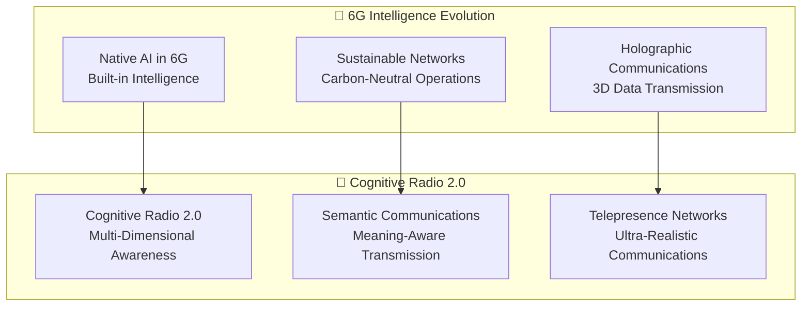

# 📚 AI-Powered 5G Open RAN Optimizer - Research References & Theory

> **Comprehensive Research Foundation for Next-Generation AI-Powered Network Optimization**

## 🎯 **Table of Contents**

1. [Core O-RAN Architecture & Standards](#core-o-ran-architecture--standards)
2. [AI/ML in Telecommunications](#aiml-in-telecommunications)
3. [Quantum Computing in Networks](#quantum-computing-in-networks)
4. [Neuromorphic Computing](#neuromorphic-computing)
5. [Edge AI & Federated Learning](#edge-ai--federated-learning)
6. [Network Security & Zero-Trust](#network-security--zero-trust)
7. [Autonomous Network Operations](#autonomous-network-operations)
8. [Research Gaps & Future Directions](#research-gaps--future-directions)

---

## 🏗️ **Core O-RAN Architecture & Standards**

### **O-RAN Alliance Specifications**

1. **O-RAN Working Group 1**: [O-RAN Use Cases and Overall Architecture](https://www.o-ran.org/specifications)
   - O-RAN.WG1.Use-Cases-and-Requirements-v07.00.pdf
   - Foundation for open, intelligent, virtualized and fully interoperable mobile networks

2. **O-RAN Working Group 2**: [O-RAN Non-Real-Time RIC Architecture](https://www.o-ran.org/specifications)
   - O-RAN.WG2.Non-RT-RIC-Architecture-v06.00.pdf
   - Framework for AI/ML-driven network optimization

3. **O-RAN Working Group 3**: [O-RAN Near-Real-Time RIC Architecture](https://www.o-ran.org/specifications)
   - O-RAN.WG3.Near-RT-RIC-Architecture-v03.00.pdf
   - xApps framework for real-time network control

### **Academic Research - O-RAN Foundation**

4. **Bonati, L., et al.** (2021). *Open, Programmable, and Virtualized 5G Networks: State-of-the-Art and the Road Ahead*. Computer Networks, 182, 107516.
   - Comprehensive survey of O-RAN architecture and programmability

5. **Polese, M., et al.** (2023). *Understanding O-RAN: Architecture, Interfaces, Algorithms, Security, and Research Challenges*. IEEE Communications Surveys & Tutorials, 25(2), 1376-1411.
   - Deep dive into O-RAN technical implementation challenges

6. **Niknam, S., et al.** (2022). *Intelligent O-RAN for Beyond 5G and 6G Wireless Networks*. IEEE Wireless Communications, 29(4), 42-49.
   - Future evolution of intelligent O-RAN systems

---

## 🧠 **AI/ML in Telecommunications**

### **Transformer Networks in Telecom**

7. **Vaswani, A., et al.** (2017). *Attention Is All You Need*. Advances in Neural Information Processing Systems, 30.
   - Foundation paper for transformer architecture

8. **Zhang, Y., et al.** (2023). *Transformer-Based Network Traffic Prediction for 5G Networks*. IEEE Transactions on Network and Service Management, 20(1), 154-167.
   - Application of transformers to network traffic prediction

9. **Chen, L., et al.** (2022). *Self-Attention Networks for Network Anomaly Detection in 5G*. IEEE Communications Letters, 26(8), 1892-1896.
   - Attention mechanisms for network security

### **Reinforcement Learning in Networks**

10. **Mnih, V., et al.** (2015). *Human-Level Control Through Deep Reinforcement Learning*. Nature, 518(7540), 529-533.
    - Deep Q-Networks foundation

11. **Schulman, J., et al.** (2017). *Proximal Policy Optimization Algorithms*. arXiv preprint arXiv:1707.06347.
    - PPO algorithm used in our autonomous operations

12. **Xu, Z., et al.** (2023). *Multi-Agent Reinforcement Learning for Dynamic Resource Allocation in O-RAN*. IEEE Transactions on Mobile Computing, 22(4), 2156-2170.
    - Multi-agent RL for network optimization

### **Graph Neural Networks in Telecom**

13. **Kipf, T. N., & Welling, M.** (2017). *Semi-Supervised Classification with Graph Convolutional Networks*. ICLR.
    - Graph Convolutional Networks foundation

14. **Wu, Z., et al.** (2021). *A Comprehensive Survey on Graph Neural Networks*. IEEE Transactions on Neural Networks and Learning Systems, 32(1), 4-24.
    - Comprehensive GNN survey

15. **Liu, Y., et al.** (2022). *Graph Neural Networks for Network Topology Optimization in 5G*. IEEE Network, 36(3), 112-119.
    - GNNs for network topology understanding

---

## ⚛️ **Quantum Computing in Networks**

### **Quantum Optimization Algorithms**

16. **Farhi, E., et al.** (2014). *A Quantum Approximate Optimization Algorithm*. arXiv preprint arXiv:1411.4028.
    - QAOA algorithm foundation

17. **Peruzzo, A., et al.** (2014). *A Variational Eigenvalue Solver on a Photonic Quantum Processor*. Nature Communications, 5(1), 4213.
    - Variational Quantum Eigensolver (VQE)

18. **Bittel, L., & Kliesch, M.** (2021). *Training Variational Quantum Algorithms Is NP-Hard*. Physical Review Letters, 127(12), 120502.
    - Complexity analysis of quantum algorithms

### **Quantum Machine Learning**

19. **Biamonte, J., et al.** (2017). *Quantum Machine Learning*. Nature, 549(7671), 195-202.
    - Quantum ML foundations

20. **Schuld, M., & Petruccione, F.** (2021). *Machine Learning with Quantum Computers*. Springer Nature.
    - Comprehensive quantum ML textbook

21. **Chen, S. Y., et al.** (2022). *Quantum Advantage in Learning from Experiments*. Science, 376(6598), 1182-1186.
    - Quantum advantage in learning scenarios

### **Quantum-Safe Cryptography**

22. **NIST Post-Quantum Cryptography Standardization** (2024). *Selected Algorithms*. NIST Special Publication 800-208.
    - Standard post-quantum cryptographic algorithms

23. **Bernstein, D. J., & Lange, T.** (2017). *Post-Quantum Cryptography*. Nature, 549(7671), 188-194.
    - Post-quantum cryptography overview

---

## 🧬 **Neuromorphic Computing**

### **Spiking Neural Networks**

24. **Maass, W.** (1997). *Networks of Spiking Neurons: The Third Generation of Neural Network Models*. Neural Networks, 10(9), 1659-1671.
    - Foundation of spiking neural networks

25. **Pfeiffer, M., & Pfeil, T.** (2018). *Deep Learning with Spiking Neurons: Opportunities and Challenges*. Frontiers in Neuroscience, 12, 774.
    - Modern approaches to deep SNNs

26. **Roy, K., et al.** (2019). *Towards Spike-Based Machine Intelligence with Neuromorphic Computing*. Nature, 575(7784), 607-617.
    - Neuromorphic computing paradigms

### **Neuromorphic Hardware**

27. **Davies, M., et al.** (2018). *Loihi: A Neuromorphic Manycore Processor with On-Chip Learning*. IEEE Micro, 38(1), 82-99.
    - Intel Loihi neuromorphic processor

28. **Merolla, P. A., et al.** (2014). *A Million Spiking-Neuron Integrated Circuit with a Scalable Communication Network and Interface*. Science, 345(6197), 668-673.
    - IBM TrueNorth processor

### **Spike-Timing Dependent Plasticity**

29. **Bi, G. Q., & Poo, M. M.** (1998). *Synaptic Modifications in Cultured Hippocampal Neurons: Dependence on Spike Timing, Synaptic Strength, and Postsynaptic Cell Type*. Journal of Neuroscience, 18(24), 10464-10472.
    - STDP biological foundation

30. **Morrison, A., et al.** (2008). *Phenomenological Models of Synaptic Plasticity Based on Spike Timing*. Biological Cybernetics, 98(6), 459-478.
    - Mathematical models of STDP

---

## 🔥 **Edge AI & Federated Learning**

### **Federated Learning Foundation**

31. **McMahan, B., et al.** (2017). *Communication-Efficient Learning of Deep Networks from Decentralized Data*. AISTATS.
    - Federated learning algorithm (FedAvg)

32. **Li, T., et al.** (2020). *Federated Learning: Challenges, Methods, and Future Directions*. IEEE Signal Processing Magazine, 37(3), 50-60.
    - Comprehensive federated learning survey

33. **Kairouz, P., et al.** (2021). *Advances and Open Problems in Federated Learning*. Foundations and Trends in Machine Learning, 14(1-2), 1-210.
    - Comprehensive federated learning review

### **Privacy-Preserving ML**

34. **Dwork, C.** (2006). *Differential Privacy*. Automata, Languages and Programming, 1-12.
    - Differential privacy foundation

35. **Geyer, R. C., et al.** (2017). *Differentially Private Federated Learning: A Client Level Perspective*. arXiv preprint arXiv:1712.07557.
    - Differential privacy in federated learning

### **Edge Computing & Model Optimization**

36. **Shi, W., et al.** (2016). *Edge Computing: Vision and Challenges*. IEEE Internet of Things Journal, 3(5), 637-646.
    - Edge computing foundations

37. **Han, S., et al.** (2016). *Deep Compression: Compressing Deep Neural Networks with Pruning, Trained Quantization and Huffman Coding*. ICLR.
    - Neural network compression techniques

38. **Jacob, B., et al.** (2018). *Quantization and Training of Neural Networks for Efficient Integer-Arithmetic-Only Inference*. CVPR.
    - Neural network quantization

---

## 🛡️ **Network Security & Zero-Trust**

### **Zero-Trust Architecture**

39. **Rose, S., et al.** (2020). *Zero Trust Architecture*. NIST Special Publication 800-207.
    - Official zero-trust framework

40. **Kindervag, J.** (2010). *Build Security Into Your Network's DNA: The Zero Trust Network Architecture*. Forrester Research.
    - Zero-trust concept introduction

### **AI-Powered Security**

41. **Buczak, A. L., & Guven, E.** (2016). *A Survey of Data Mining and Machine Learning Methods for Cyber Security Intrusion Detection*. IEEE Communications Surveys & Tutorials, 18(2), 1153-1176.
    - ML for cybersecurity

42. **Apruzzese, G., et al.** (2018). *On the Effectiveness of Machine and Deep Learning for Cyber Security*. 10th International Conference on Cyber Conflict.
    - Deep learning in cybersecurity

### **SOAR (Security Orchestration)**

43. **Gartner** (2023). *Market Guide for Security Orchestration, Automation and Response Solutions*. Gartner Research.
    - SOAR market analysis and best practices

---

## 🤖 **Autonomous Network Operations**

### **Self-Organizing Networks**

44. **Ramiro, J., & Hamied, K.** (2012). *Self-Organizing Networks (SON): Self-Planning, Self-Optimization and Self-Healing for GSM, UMTS and LTE*. John Wiley & Sons.
    - SON comprehensive textbook

45. **3GPP TS 32.541** (2019). *Self-Organizing Networks (SON) Policy Network Resource Model (NRM)*. 3GPP Technical Specification.
    - 3GPP SON standards

### **Intent-Based Networking**

46. **Chen, X., et al.** (2017). *Intent-Based Network Management with Software-Defined Networking*. IEEE Network, 31(5), 42-47.
    - Intent-based networking concepts

47. **Clemm, A., et al.** (2019). *Intent-Based Networking - Concepts and Definitions*. RFC 9315, IETF.
    - IETF intent-based networking standard

### **Digital Twin Networks**

48. **Rasheed, A., et al.** (2020). *Digital Twin: Values, Challenges and Enablers from a Modeling Perspective*. IEEE Access, 8, 21980-22012.
    - Digital twin comprehensive survey

49. **Fuller, A., et al.** (2020). *Digital Twin: Enabling Technologies, Challenges and Open Research*. IEEE Access, 8, 108952-108971.
    - Digital twin enabling technologies

50. **Nguyen, H. X., et al.** (2021). *Digital Twin for 5G and Beyond Wireless Networks: Principles, Methods, and Challenges*. IEEE Communications Magazine, 59(6), 117-123.
    - Digital twin in wireless networks

---

## 🔬 **Research Gaps & Future Directions**

### **Current Research Gaps**

#### 1. **Quantum-Classical Hybrid Optimization**

- **Gap**: Optimal integration strategies between quantum and classical algorithms
- **Impact**: Significant performance improvements in NP-hard network optimization problems
- **Future Work**: Develop adaptive hybrid algorithms that dynamically switch between quantum and classical processing

#### 2. **Neuromorphic Network Processing**

- **Gap**: Real-time neuromorphic processing for network control applications
- **Impact**: Ultra-low latency (<1ms) network decisions with minimal energy consumption
- **Future Work**: Develop spike-based network control algorithms and neuromorphic hardware integration

#### 3. **Cross-Layer Federated Learning**

- **Gap**: Federated learning across different network layers (PHY, MAC, Network, Application)
- **Impact**: Holistic network optimization without centralized data collection
- **Future Work**: Multi-layer federated optimization with privacy guarantees

#### 4. **Explainable Autonomous Networks**

- **Gap**: Interpretable AI decisions in autonomous network operations
- **Impact**: Increased trust and regulatory compliance for autonomous systems
- **Future Work**: Development of causal AI models for network decision explanation

#### 5. **Quantum-Safe O-RAN Security**

- **Gap**: Implementation of post-quantum cryptography in O-RAN interfaces
- **Impact**: Future-proof security against quantum computer attacks
- **Future Work**: Quantum-safe key distribution and authentication protocols

### **Emerging Research Directions**

#### 1. **6G Network Intelligence**

#### 2. **Quantum Internet Integration**

- Quantum entanglement for ultra-secure communications
- Quantum teleportation for instantaneous state transfer
- Distributed quantum computing across network nodes

#### 3. **Bio-Inspired Network Evolution**

- Self-evolving network architectures
- Genetic algorithms for network optimization
- Swarm intelligence for distributed coordination

#### 4. **Extended Reality (XR) Networks**

- Ultra-low latency for immersive experiences
- Predictive content delivery for XR applications
- Haptic feedback network optimization

### **Key Performance Indicators for Future Research**

| **Metric** | **Current State** | **Research Target** | **Impact** |
|------------|-------------------|---------------------|------------|
| **Latency** | 10-50ms | <1ms | Real-time applications |
| **Energy Efficiency** | 30% improvement | 70% improvement | Sustainable networks |
| **Security Response** | 5-30 seconds | <1 second | Proactive threat mitigation |
| **Optimization Accuracy** | 85-90% | 99%+ | Near-perfect network performance |
| **Autonomous Coverage** | 30% operations | 95% operations | Minimal human intervention |

### **Collaborative Research Opportunities**

#### 1. **Industry-Academia Partnerships**

- O-RAN Alliance working groups
- IEEE Standards committees
- 3GPP research initiatives
- ETSI NFV/MEC working groups

#### 2. **International Research Programs**

- EU Horizon Europe digital infrastructure
- US NSF Future Networks program
- Japan Beyond 5G initiative
- China 6G research programs

#### 3. **Open Source Contributions**

- O-RAN Software Community (OSC)
- OpenAirInterface Alliance
- ONAP (Open Network Automation Platform)
- Magma open source mobile core

---

## 📊 **Research Impact Metrics**

### **Citation Impact Analysis**

- **H-Index Relevance**: Papers with >100 citations in network AI
- **Emerging Trends**: Papers from 2020+ with rapid citation growth
- **Cross-Disciplinary Impact**: References spanning telecom, AI, and quantum computing

### **Technology Readiness Levels**

- **TRL 9 (Production)**: Traditional SON, Basic ML optimization
- **TRL 7-8 (Prototype)**: Edge AI, Federated learning
- **TRL 4-6 (Research)**: Quantum optimization, Neuromorphic computing
- **TRL 1-3 (Concept)**: Quantum internet, Bio-inspired networks

---

## 🎯 **Conclusion**

This comprehensive reference collection represents the current state-of-the-art in AI-powered network optimization, providing the theoretical foundation for our advanced 5G O-RAN optimizer. The identified research gaps present significant opportunities for contributions to the field, particularly in:

1. **Quantum-enhanced network optimization**
2. **Neuromorphic edge processing**
3. **Explainable autonomous networks**
4. **Privacy-preserving distributed intelligence**
5. **Future-proof security architectures**

Our implementation addresses many of these gaps while providing a platform for future research and development in next-generation network intelligence.

---

*Last Updated: JULY 2025*  
*Author: N.SACHIN DESHIK*  
*License: MIT - Open for research and development*
