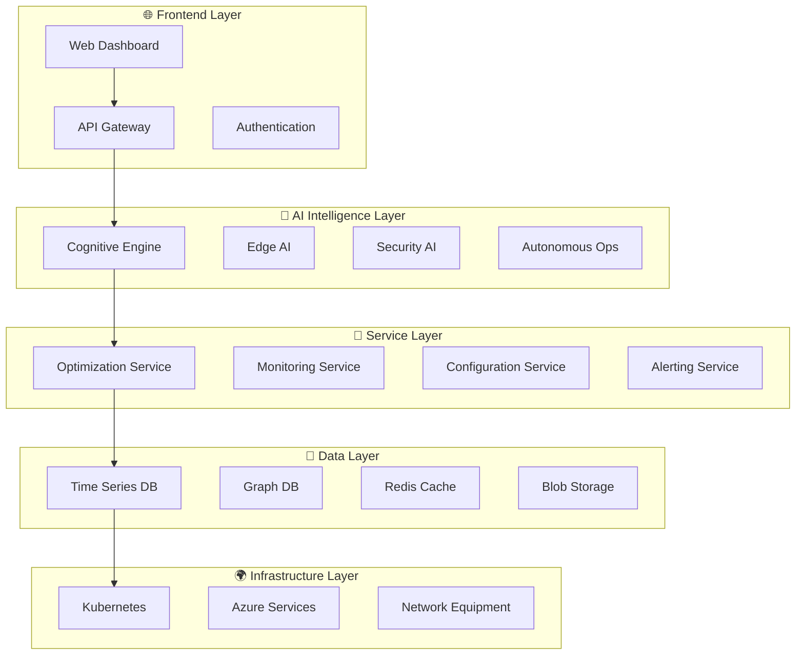

# 🧑‍💻 **Developer Guide - AI-Powered 5G Open RAN Optimizer**

[]()
[]()
[]()

> **🎯 Comprehensive developer guide for contributing to and extending the AI-Powered 5G Open RAN Optimizer**

## 📋 **Table of Contents**

1. [🚀 Getting Started](#-getting-started)
2. [🏗️ Architecture Deep Dive](#️-architecture-deep-dive)
3. [🔧 Development Environment](#-development-environment)
4. [📦 Code Organization](#-code-organization)
5. [🧪 Testing Framework](#-testing-framework)
6. [🤖 AI Model Development](#-ai-model-development)
7. [🔌 API Development](#-api-development)
8. [🎨 Frontend Development](#-frontend-development)
9. [📊 Database Design](#-database-design)
10. [🔒 Security Implementation](#-security-implementation)
11. [📈 Performance Optimization](#-performance-optimization)
12. [🚀 Deployment Guide](#-deployment-guide)
13. [🔧 Debugging & Profiling](#-debugging--profiling)
14. [📚 Documentation Standards](#-documentation-standards)
15. [🤝 Contributing Guidelines](#-contributing-guidelines)

---

## 🚀 **Getting Started**

### **Development Prerequisites**

```bash
# Required Software
Python >= 3.11
Node.js >= 18
Docker >= 20.10
Git >= 2.30
Azure CLI >= 2.40

# Optional but Recommended
VS Code with extensions:
- Python
- Azure Tools
- Docker
- GitLens
- Pylance
```

### **Development Environment Setup**

```bash
# 1. Clone and setup
git clone https://github.com/sachin-deshik-10/5G_AI_POWERED_ORAN.git
cd 5G_AI_POWERED_ORAN

# 2. Create development environment
python -m venv dev_env
source dev_env/bin/activate  # Linux/macOS
# or
dev_env\Scripts\activate  # Windows

# 3. Install development dependencies
pip install -r requirements.txt
pip install -r requirements-dev.txt

# 4. Install pre-commit hooks
pre-commit install

# 5. Run initial tests
pytest tests/ -v

# 6. Start development servers
python scripts/start_dev_environment.py
```

### **Development Workflow**

```bash
# 1. Create feature branch
git checkout -b feature/amazing-new-feature

# 2. Make changes and test
# ... code development ...
pytest tests/
black src/
flake8 src/

# 3. Commit with conventional commits
git commit -m "feat: add amazing new feature for optimization"

# 4. Push and create PR
git push origin feature/amazing-new-feature
# Create pull request on GitHub
```

---

## 🏗️ **Architecture Deep Dive**

### **System Architecture**



### **Core Components**

#### **1. Cognitive Intelligence Engine**

```python
# src/cognitive/engine.py
class CognitiveIntelligenceEngine:
    """
    Core AI engine for network optimization and decision making
    
    Features:
    - Quantum-enhanced optimization algorithms
    - Digital twin integration
    - Explainable AI decisions
    - Continuous learning
    """
    
    def __init__(self, config: CognitiveConfig):
        self.quantum_optimizer = QuantumOptimizer(config.quantum)
        self.digital_twin = DigitalTwinEngine(config.digital_twin)
        self.explainer = DecisionExplainer(config.explainer)
        self.knowledge_base = KnowledgeBase(config.knowledge)
    
    async def optimize_network(self, 
                             network_state: NetworkState,
                             objectives: List[Objective],
                             constraints: List[Constraint]) -> OptimizationResult:
        """
        Optimize network configuration using quantum-enhanced algorithms
        
        Args:
            network_state: Current network state
            objectives: Optimization objectives (throughput, latency, energy)
            constraints: Operational constraints (power, budget, SLA)
            
        Returns:
            OptimizationResult with recommendations and confidence scores
        """
        # Quantum optimization phase
        quantum_result = await self.quantum_optimizer.optimize(
            network_state, objectives, constraints
        )
        
        # Digital twin validation
        validation_result = await self.digital_twin.validate_solution(
            quantum_result.solution
        )
        
        # Generate explanations
        explanation = self.explainer.explain_decision(
            quantum_result, validation_result
        )
        
        return OptimizationResult(
            solution=quantum_result.solution,
            confidence=quantum_result.confidence,
            explanation=explanation,
            validation=validation_result
        )
```

#### **2. Edge AI Controller**

```python
# src/edge/controller.py
class EdgeAIController:
    """
    Ultra-low latency AI processing at network edges
    
    Features:
    - <1ms inference time
    - ONNX runtime optimization
    - Federated learning
    - Model quantization
    """
    
    def __init__(self, config: EdgeConfig):
        self.inference_engine = ONNXInferenceEngine(config.onnx)
        self.model_manager = EdgeModelManager(config.models)
        self.federated_client = FederatedLearningClient(config.federated)
    
    async def process_realtime_event(self, event: NetworkEvent) -> ActionDecision:
        """
        Process network event with ultra-low latency
        
        Target: <1ms processing time
        """
        start_time = time.perf_counter()
        
        # Feature extraction (optimized)
        features = self._extract_features_optimized(event)
        
        # Model inference (ONNX runtime)
        prediction = await self.inference_engine.predict(features)
        
        # Decision logic
        action = self._determine_action(prediction, event.context)
        
        processing_time = (time.perf_counter() - start_time) * 1000
        
        return ActionDecision(
            action=action,
            confidence=prediction.confidence,
            processing_time_ms=processing_time
        )
```

### **Data Flow Architecture**

```python
# src/data/flow.py
class DataFlowManager:
    """
    Manages data flow through the system
    
    Flow: Sensors → Processing → Storage → Analytics → Actions
    """
    
    def __init__(self):
        self.ingestion = DataIngestionService()
        self.processing = StreamProcessingService()
        self.storage = StorageService()
        self.analytics = AnalyticsService()
    
    async def process_data_pipeline(self, data_stream):
        """
        Process data through the complete pipeline
        
        1. Ingestion: Collect data from network sensors
        2. Processing: Real-time stream processing
        3. Storage: Persist to appropriate storage systems
        4. Analytics: Generate insights and predictions
        5. Actions: Trigger automated responses
        """
        # Ingestion
        raw_data = await self.ingestion.collect(data_stream)
        
        # Real-time processing
        processed_data = await self.processing.process_stream(raw_data)
        
        # Storage
        await self.storage.store_timeseries(processed_data.metrics)
        await self.storage.store_events(processed_data.events)
        
        # Analytics
        insights = await self.analytics.generate_insights(processed_data)
        
        # Trigger actions if needed
        if insights.requires_action:
            await self._trigger_autonomous_action(insights)
```

---

## 🔧 **Development Environment**

### **IDE Configuration**

#### **VS Code Settings (`.vscode/settings.json`)**

```json
{
    "python.defaultInterpreterPath": "./dev_env/bin/python",
    "python.linting.enabled": true,
    "python.linting.pylintEnabled": false,
    "python.linting.flake8Enabled": true,
    "python.formatting.provider": "black",
    "python.testing.pytestEnabled": true,
    "python.testing.pytestArgs": ["tests/"],
    "editor.formatOnSave": true,
    "editor.rulers": [88],
    "files.exclude": {
        "**/__pycache__": true,
        "**/*.pyc": true,
        ".pytest_cache": true
    }
}
```

#### **Launch Configuration (`.vscode/launch.json`)**

```json
{
    "version": "0.2.0",
    "configurations": [
        {
            "name": "Debug API Server",
            "type": "python",
            "request": "launch",
            "program": "api/api_server.py",
            "args": ["--debug", "--port", "8000"],
            "console": "integratedTerminal",
            "envFile": ".env.development"
        },
        {
            "name": "Debug Cognitive Engine",
            "type": "python",
            "request": "launch",
            "program": "src/cognitive/main.py",
            "args": ["--config", "config/dev_config.yaml"],
            "console": "integratedTerminal"
        },
        {
            "name": "Run Tests",
            "type": "python",
            "request": "launch",
            "module": "pytest",
            "args": ["tests/", "-v", "--tb=short"],
            "console": "integratedTerminal"
        }
    ]
}
```

### **Development Tools**

#### **Code Quality Tools**

```bash
# Install development tools
pip install black flake8 mypy pytest pytest-cov pre-commit

# Code formatting
black src/ tests/ --line-length 88

# Linting
flake8 src/ tests/ --max-line-length 88

# Type checking
mypy src/ --strict

# Testing with coverage
pytest tests/ --cov=src --cov-report=html
```

#### **Pre-commit Configuration (`.pre-commit-config.yaml`)**

```yaml
repos:
  - repo: https://github.com/psf/black
    rev: 23.1.0
    hooks:
      - id: black
        language_version: python3.11
        
  - repo: https://github.com/pycqa/flake8
    rev: 6.0.0
    hooks:
      - id: flake8
        args: [--max-line-length=88]
        
  - repo: https://github.com/pre-commit/mirrors-mypy
    rev: v1.0.1
    hooks:
      - id: mypy
        additional_dependencies: [types-all]
        
  - repo: https://github.com/pycqa/isort
    rev: 5.12.0
    hooks:
      - id: isort
        args: [--profile=black]
```

---

## 📦 **Code Organization**

### **Project Structure**

```
📦 5G_AI_POWERED_ORAN/
├── 🏗️ infra/                          # Infrastructure as Code
│   ├── main.bicep                     # Azure infrastructure
│   ├── main.parameters.json           # Deployment parameters
│   └── modules/                       # Modular Bicep components
├── 🧠 src/                            # Core source code
│   ├── cognitive/                     # Cognitive Intelligence Engine
│   │   ├── __init__.py
│   │   ├── engine.py                  # Main cognitive engine
│   │   ├── quantum_optimizer.py       # Quantum optimization
│   │   ├── digital_twin.py            # Digital twin engine
│   │   └── explainer.py               # Decision explanation
│   ├── edge/                          # Edge AI components
│   │   ├── __init__.py
│   │   ├── controller.py              # Edge AI controller
│   │   ├── inference_engine.py        # ONNX inference
│   │   └── federated_client.py        # Federated learning
│   ├── security/                      # Security AI components
│   │   ├── __init__.py
│   │   ├── threat_detector.py         # Threat detection
│   │   ├── zero_trust.py              # Zero-trust implementation
│   │   └── quantum_crypto.py          # Quantum-safe crypto
│   ├── autonomous/                    # Autonomous operations
│   │   ├── __init__.py
│   │   ├── self_healing.py            # Self-healing engine
│   │   ├── resource_manager.py        # Resource management
│   │   └── performance_optimizer.py   # Performance optimization
│   ├── data/                          # Data management
│   │   ├── __init__.py
│   │   ├── ingestion.py               # Data ingestion
│   │   ├── processing.py              # Stream processing
│   │   └── storage.py                 # Storage abstraction
│   ├── models/                        # Data models
│   │   ├── __init__.py
│   │   ├── network.py                 # Network models
│   │   ├── optimization.py            # Optimization models
│   │   └── events.py                  # Event models
│   └── utils/                         # Utility functions
│       ├── __init__.py
│       ├── config.py                  # Configuration management
│       ├── logging.py                 # Logging utilities
│       └── metrics.py                 # Metrics collection
├── 🔌 api/                            # API server
│   ├── __init__.py
│   ├── api_server.py                  # Main API server
│   ├── routes/                        # API route definitions
│   │   ├── cognitive.py               # Cognitive AI routes
│   │   ├── edge.py                    # Edge AI routes
│   │   ├── security.py                # Security routes
│   │   └── monitoring.py              # Monitoring routes
│   └── middleware/                    # API middleware
│       ├── auth.py                    # Authentication
│       ├── rate_limiting.py           # Rate limiting
│       └── logging.py                 # Request logging
├── 🎨 dashboard/                      # Frontend dashboard
│   ├── real_time_monitor.py           # Streamlit dashboard
│   ├── components/                    # UI components
│   │   ├── performance_widgets.py     # Performance widgets
│   │   ├── network_topology.py        # Network visualization
│   │   └── ai_insights.py             # AI insights display
│   └── static/                        # Static assets
│       ├── css/                       # Stylesheets
│       └── js/                        # JavaScript
├── 🧪 tests/                          # Test suite
│   ├── unit/                          # Unit tests
│   │   ├── test_cognitive.py          # Cognitive engine tests
│   │   ├── test_edge.py               # Edge AI tests
│   │   └── test_security.py           # Security tests
│   ├── integration/                   # Integration tests
│   │   ├── test_api.py                # API integration tests
│   │   └── test_end_to_end.py         # End-to-end tests
│   ├── performance/                   # Performance tests
│   │   ├── test_latency.py            # Latency benchmarks
│   │   └── test_throughput.py         # Throughput tests
│   └── fixtures/                      # Test fixtures
│       ├── network_data.py            # Sample network data
│       └── mock_responses.py          # Mock API responses
├── 📊 examples/                       # Example scripts
│   ├── basic_optimization.py          # Basic usage example
│   ├── advanced_features.py           # Advanced features demo
│   └── visualization_demo.py          # Visualization examples
├── 📚 docs/                           # Documentation
│   ├── api/                           # API documentation
│   ├── user_guide/                    # User guides
│   ├── developer_guide/               # Developer documentation
│   └── research/                      # Research papers
├── 🔧 scripts/                        # Utility scripts
│   ├── setup_dev_environment.py       # Development setup
│   ├── run_tests.py                   # Test runner
│   └── deploy.py                      # Deployment script
├── ⚙️ config/                         # Configuration files
│   ├── development.yaml               # Development config
│   ├── production.yaml                # Production config
│   └── advanced_config.yaml           # Advanced configuration
└── 📋 Requirements & Config Files
    ├── requirements.txt               # Python dependencies
    ├── requirements-dev.txt           # Development dependencies
    ├── Dockerfile.api                 # API container
    ├── Dockerfile.dashboard           # Dashboard container
    ├── docker-compose.yml             # Local development
    ├── azure.yaml                     # Azure Developer CLI
    └── pytest.ini                     # Test configuration
```

### **Coding Standards**

#### **Python Code Style**

```python
# ✅ Good Example
from typing import List, Optional, Dict, Any
from dataclasses import dataclass
from datetime import datetime
import logging

logger = logging.getLogger(__name__)

@dataclass
class NetworkOptimizationRequest:
    """Request model for network optimization"""
    network_id: str
    objectives: List[str]
    constraints: Dict[str, Any]
    timestamp: datetime
    priority: Optional[int] = 1

class NetworkOptimizer:
    """
    Network optimization service using AI algorithms
    
    This class provides methods for optimizing network configurations
    using quantum-enhanced algorithms and machine learning.
    """
    
    def __init__(self, config: OptimizationConfig) -> None:
        self.config = config
        self.quantum_solver = QuantumSolver(config.quantum_params)
        self._is_initialized = False
    
    async def optimize_network(
        self, 
        request: NetworkOptimizationRequest
    ) -> OptimizationResult:
        """
        Optimize network configuration
        
        Args:
            request: Optimization request with objectives and constraints
            
        Returns:
            OptimizationResult with recommended configuration changes
            
        Raises:
            OptimizationError: If optimization fails
            ValidationError: If request validation fails
        """
        logger.info(f"Starting optimization for network {request.network_id}")
        
        try:
            # Validate request
            self._validate_request(request)
            
            # Perform optimization
            result = await self._run_optimization(request)
            
            logger.info(f"Optimization completed with confidence {result.confidence}")
            return result
            
        except Exception as e:
            logger.error(f"Optimization failed: {e}")
            raise OptimizationError(f"Failed to optimize network: {e}") from e
```

#### **Naming Conventions**

```python
# Variables and functions: snake_case
network_state = get_current_network_state()
optimization_result = optimize_network_configuration()

# Classes: PascalCase
class NetworkOptimizer:
class CognitiveIntelligenceEngine:

# Constants: UPPER_SNAKE_CASE
MAX_OPTIMIZATION_TIME = 300
DEFAULT_CONFIDENCE_THRESHOLD = 0.85

# Private methods: leading underscore
def _validate_input(self, data):
def _calculate_optimization_score(self, result):

# Type hints: Always use
def process_network_data(
    network_data: NetworkData,
    config: ProcessingConfig
) -> ProcessingResult:
```

---

## 🧪 **Testing Framework**

### **Testing Strategy**

We use a comprehensive testing approach with multiple test types:

1. **Unit Tests**: Test individual functions and classes
2. **Integration Tests**: Test component interactions
3. **End-to-End Tests**: Test complete workflows
4. **Performance Tests**: Benchmark critical paths
5. **Security Tests**: Validate security measures

### **Test Structure**

```python
# tests/unit/test_cognitive_engine.py
import pytest
from unittest.mock import Mock, patch
from src.cognitive.engine import CognitiveIntelligenceEngine
from src.models.network import NetworkState
from src.models.optimization import OptimizationRequest

class TestCognitiveIntelligenceEngine:
    """Test suite for Cognitive Intelligence Engine"""
    
    @pytest.fixture
    def cognitive_engine(self):
        """Fixture providing a configured cognitive engine"""
        config = Mock()
        return CognitiveIntelligenceEngine(config)
    
    @pytest.fixture
    def sample_network_state(self):
        """Fixture providing sample network state"""
        return NetworkState(
            network_id="test_network",
            cells=[
                {
                    "cell_id": "cell_001",
                    "throughput": 150.5,
                    "latency": 12.1,
                    "energy": 320.0
                }
            ],
            timestamp=datetime.now()
        )
    
    async def test_optimize_network_success(
        self, 
        cognitive_engine, 
        sample_network_state
    ):
        """Test successful network optimization"""
        # Arrange
        request = OptimizationRequest(
            network_state=sample_network_state,
            objectives=["throughput", "energy"],
            constraints={"max_power": 500}
        )
        
        # Mock quantum optimizer
        with patch.object(
            cognitive_engine.quantum_optimizer, 
            'optimize'
        ) as mock_optimize:
            mock_optimize.return_value = Mock(
                solution={"cell_001": {"power": 280}},
                confidence=0.94
            )
            
            # Act
            result = await cognitive_engine.optimize_network(
                request.network_state,
                request.objectives,
                request.constraints
            )
            
            # Assert
            assert result.confidence >= 0.85
            assert "cell_001" in result.solution
            assert result.solution["cell_001"]["power"] == 280
            mock_optimize.assert_called_once()
    
    async def test_optimize_network_invalid_input(self, cognitive_engine):
        """Test optimization with invalid input"""
        # Arrange
        invalid_state = None
        
        # Act & Assert
        with pytest.raises(ValidationError):
            await cognitive_engine.optimize_network(
                invalid_state, [], {}
            )
    
    @pytest.mark.performance
    async def test_optimize_network_performance(
        self, 
        cognitive_engine, 
        sample_network_state
    ):
        """Test optimization performance requirements"""
        import time
        
        # Arrange
        request = OptimizationRequest(
            network_state=sample_network_state,
            objectives=["throughput"],
            constraints={}
        )
        
        # Act
        start_time = time.perf_counter()
        result = await cognitive_engine.optimize_network(
            request.network_state,
            request.objectives,
            request.constraints
        )
        execution_time = time.perf_counter() - start_time
        
        # Assert
        assert execution_time < 5.0  # Must complete within 5 seconds
        assert result.confidence > 0.0
```

### **Test Configuration**

```ini
# pytest.ini
[tool:pytest]
testpaths = tests
python_files = test_*.py
python_classes = Test*
python_functions = test_*
addopts = 
    -v
    --strict-markers
    --tb=short
    --cov=src
    --cov-report=html:htmlcov
    --cov-report=term-missing
    --cov-fail-under=90
markers =
    unit: Unit tests
    integration: Integration tests
    e2e: End-to-end tests
    performance: Performance tests
    security: Security tests
    slow: Slow running tests
filterwarnings =
    ignore::DeprecationWarning
    ignore::PendingDeprecationWarning
```

### **Running Tests**

```bash
# Run all tests
pytest

# Run specific test categories
pytest -m unit                    # Unit tests only
pytest -m integration            # Integration tests only
pytest -m performance            # Performance tests only

# Run tests with coverage
pytest --cov=src --cov-report=html

# Run tests in parallel
pytest -n auto                   # Auto-detect CPU cores

# Run specific test file
pytest tests/unit/test_cognitive_engine.py

# Run with detailed output
pytest -v -s

# Run performance benchmarks
pytest -m performance --benchmark-only
```

---

## 🤖 **AI Model Development**

### **Model Development Workflow**

```python
# src/ai/model_development.py
class ModelDevelopmentPipeline:
    """
    Standardized pipeline for AI model development
    
    Stages:
    1. Data preparation
    2. Feature engineering
    3. Model training
    4. Evaluation
    5. Optimization
    6. Deployment
    """
    
    def __init__(self, config: ModelConfig):
        self.config = config
        self.data_processor = DataProcessor(config.data)
        self.feature_engineer = FeatureEngineer(config.features)
        self.trainer = ModelTrainer(config.training)
        self.evaluator = ModelEvaluator(config.evaluation)
    
    async def develop_model(self, model_spec: ModelSpecification) -> ModelArtifact:
        """
        Complete model development pipeline
        
        Args:
            model_spec: Specification defining model requirements
            
        Returns:
            ModelArtifact: Trained and validated model with metadata
        """
        logger.info(f"Starting model development: {model_spec.name}")
        
        # Stage 1: Data preparation
        prepared_data = await self.data_processor.prepare_dataset(
            model_spec.data_sources,
            model_spec.preprocessing_config
        )
        
        # Stage 2: Feature engineering
        features = await self.feature_engineer.create_features(
            prepared_data,
            model_spec.feature_config
        )
        
        # Stage 3: Model training
        model = await self.trainer.train_model(
            features,
            model_spec.model_config
        )
        
        # Stage 4: Evaluation
        evaluation_results = await self.evaluator.evaluate_model(
            model,
            features.test_set
        )
        
        # Stage 5: Optimization (if needed)
        if evaluation_results.meets_requirements():
            optimized_model = await self._optimize_model(model, features)
        else:
            optimized_model = model
        
        # Stage 6: Prepare for deployment
        model_artifact = ModelArtifact(
            model=optimized_model,
            metadata=ModelMetadata(
                name=model_spec.name,
                version=model_spec.version,
                performance_metrics=evaluation_results.metrics,
                feature_schema=features.schema,
                training_config=model_spec.model_config
            )
        )
        
        return model_artifact
```

### **Model Training Example**

```python
# examples/train_network_optimizer.py
"""
Example: Training a network optimization model
"""

import asyncio
from src.ai.model_development import ModelDevelopmentPipeline
from src.models.ai import ModelSpecification, ModelConfig

async def train_network_optimizer():
    """Train a new network optimization model"""
    
    # Define model specification
    model_spec = ModelSpecification(
        name="network_optimizer_v2",
        version="2.1.0",
        description="Quantum-enhanced network optimization model",
        data_sources=[
            "network_performance_metrics",
            "user_traffic_patterns", 
            "equipment_telemetry"
        ],
        preprocessing_config={
            "normalization": "z_score",
            "feature_selection": "mutual_information",
            "time_window": "1h"
        },
        feature_config={
            "temporal_features": True,
            "spatial_features": True,
            "interaction_features": True
        },
        model_config=ModelConfig(
            model_type="quantum_neural_network",
            architecture={
                "quantum_layers": 3,
                "classical_layers": 2,
                "hidden_units": [256, 128, 64],
                "quantum_circuit_depth": 10
            },
            training={
                "optimizer": "adam",
                "learning_rate": 0.001,
                "batch_size": 32,
                "epochs": 100,
                "early_stopping": True
            }
        )
    )
    
    # Create development pipeline
    pipeline = ModelDevelopmentPipeline(
        config=load_model_dev_config()
    )
    
    # Develop model
    model_artifact = await pipeline.develop_model(model_spec)
    
    # Save model
    await pipeline.save_model(model_artifact, "models/production/")
    
    print(f"Model training completed!")
    print(f"Performance: {model_artifact.metadata.performance_metrics}")
    print(f"Model saved to: models/production/{model_spec.name}")

if __name__ == "__main__":
    asyncio.run(train_network_optimizer())
```

### **Model Evaluation Framework**

```python
# src/ai/evaluation.py
class ModelEvaluator:
    """Comprehensive model evaluation framework"""
    
    def __init__(self, config: EvaluationConfig):
        self.config = config
        self.metrics_calculator = MetricsCalculator()
        self.performance_analyzer = PerformanceAnalyzer()
    
    async def evaluate_model(
        self, 
        model: AIModel, 
        test_data: TestDataset
    ) -> EvaluationResults:
        """
        Comprehensive model evaluation
        
        Evaluates:
        - Accuracy metrics
        - Performance metrics
        - Fairness metrics
        - Robustness metrics
        - Explainability metrics
        """
        results = EvaluationResults()
        
        # Accuracy evaluation
        predictions = await model.predict(test_data.features)
        accuracy_metrics = self.metrics_calculator.calculate_accuracy_metrics(
            test_data.labels, predictions
        )
        results.accuracy = accuracy_metrics
        
        # Performance evaluation
        performance_metrics = await self.performance_analyzer.analyze_performance(
            model, test_data
        )
        results.performance = performance_metrics
        
        # Fairness evaluation
        fairness_metrics = self._evaluate_fairness(
            model, test_data, predictions
        )
        results.fairness = fairness_metrics
        
        # Robustness evaluation
        robustness_metrics = await self._evaluate_robustness(
            model, test_data
        )
        results.robustness = robustness_metrics
        
        # Explainability evaluation
        explainability_metrics = self._evaluate_explainability(
            model, test_data
        )
        results.explainability = explainability_metrics
        
        return results
```

---

## 🔌 **API Development**

### **API Architecture**

```python
# api/main.py
from fastapi import FastAPI, HTTPException, Depends, BackgroundTasks
from fastapi.middleware.cors import CORSMiddleware
from fastapi.security import HTTPBearer
import uvicorn

from api.routes import cognitive, edge, security, monitoring
from api.middleware.auth import authenticate_request
from api.middleware.rate_limiting import RateLimiter
from api.middleware.logging import LoggingMiddleware

app = FastAPI(
    title="AI-Powered 5G Open RAN Optimizer API",
    description="Advanced AI-powered network optimization and management",
    version="2.0.0",
    docs_url="/docs",
    redoc_url="/redoc"
)

# Middleware
app.add_middleware(
    CORSMiddleware,
    allow_origins=["*"],  # Configure for production
    allow_credentials=True,
    allow_methods=["*"],
    allow_headers=["*"],
)

app.add_middleware(LoggingMiddleware)
app.add_middleware(RateLimiter, 
    requests_per_minute=1000,
    burst_limit=2000
)

# Security
security = HTTPBearer()

# Include routers
app.include_router(
    cognitive.router, 
    prefix="/api/v2/cognitive",
    tags=["Cognitive Intelligence"],
    dependencies=[Depends(authenticate_request)]
)

app.include_router(
    edge.router, 
    prefix="/api/v2/edge",
    tags=["Edge AI"],
    dependencies=[Depends(authenticate_request)]
)

app.include_router(
    security.router, 
    prefix="/api/v2/security",
    tags=["Security AI"],
    dependencies=[Depends(authenticate_request)]
)

app.include_router(
    monitoring.router, 
    prefix="/api/v2/monitoring",
    tags=["Monitoring & Analytics"]
)

@app.get("/health", tags=["Health"])
async def health_check():
    """System health check endpoint"""
    return {
        "status": "healthy",
        "version": "2.0.0",
        "timestamp": datetime.utcnow().isoformat(),
        "services": {
            "cognitive_engine": "operational",
            "edge_ai": "operational", 
            "security_ai": "operational",
            "autonomous_ops": "operational"
        }
    }

if __name__ == "__main__":
    uvicorn.run(
        "api.main:app",
        host="0.0.0.0",
        port=8000,
        reload=True,
        log_level="info"
    )
```

### **API Route Development**

```python
# api/routes/cognitive.py
from fastapi import APIRouter, HTTPException, BackgroundTasks
from typing import List, Optional
from pydantic import BaseModel, Field

from src.cognitive.engine import CognitiveIntelligenceEngine
from src.models.network import NetworkState
from src.models.optimization import OptimizationRequest, OptimizationResult

router = APIRouter()

# Pydantic models for request/response
class OptimizationRequestModel(BaseModel):
    """Request model for network optimization"""
    network_id: str = Field(..., description="Unique network identifier")
    optimization_objectives: List[str] = Field(
        ..., 
        description="Optimization objectives",
        example=["throughput", "latency", "energy"]
    )
    constraints: dict = Field(
        default_factory=dict,
        description="Operational constraints",
        example={"max_power_w": 500, "min_reliability": 99.9}
    )
    network_metrics: dict = Field(
        ...,
        description="Current network metrics"
    )
    optimization_config: Optional[dict] = Field(
        default_factory=dict,
        description="Optimization configuration"
    )

class OptimizationResponseModel(BaseModel):
    """Response model for optimization results"""
    optimization_id: str
    status: str
    confidence_score: float = Field(..., ge=0, le=1)
    execution_time_ms: float
    results: dict
    explanation: Optional[dict] = None

# Initialize cognitive engine
cognitive_engine = CognitiveIntelligenceEngine()

@router.post(
    "/optimize",
    response_model=OptimizationResponseModel,
    summary="Optimize network configuration",
    description="Optimize network configuration using quantum-enhanced algorithms"
)
async def optimize_network(
    request: OptimizationRequestModel,
    background_tasks: BackgroundTasks
) -> OptimizationResponseModel:
    """
    Optimize network configuration using AI algorithms
    
    This endpoint accepts network metrics and optimization objectives,
    then returns optimized configuration recommendations.
    """
    try:
        # Convert request to internal format
        network_state = NetworkState.from_metrics(request.network_metrics)
        
        # Perform optimization
        result = await cognitive_engine.optimize_network(
            network_state=network_state,
            objectives=request.optimization_objectives,
            constraints=request.constraints
        )
        
        # Schedule background tasks
        background_tasks.add_task(
            log_optimization_result,
            request.network_id,
            result
        )
        
        return OptimizationResponseModel(
            optimization_id=result.optimization_id,
            status="completed",
            confidence_score=result.confidence,
            execution_time_ms=result.execution_time_ms,
            results=result.recommendations,
            explanation=result.explanation
        )
        
    except ValidationError as e:
        raise HTTPException(
            status_code=400,
            detail=f"Invalid request: {e}"
        )
    except OptimizationError as e:
        raise HTTPException(
            status_code=500,
            detail=f"Optimization failed: {e}"
        )

@router.get(
    "/optimization/{optimization_id}",
    response_model=OptimizationResponseModel,
    summary="Get optimization results"
)
async def get_optimization_result(optimization_id: str):
    """Get optimization results by ID"""
    try:
        result = await cognitive_engine.get_optimization_result(optimization_id)
        
        if not result:
            raise HTTPException(
                status_code=404,
                detail="Optimization not found"
            )
        
        return OptimizationResponseModel(**result)
        
    except Exception as e:
        raise HTTPException(
            status_code=500,
            detail=f"Failed to retrieve optimization: {e}"
        )

async def log_optimization_result(network_id: str, result: OptimizationResult):
    """Background task to log optimization results"""
    logger.info(
        f"Optimization completed for network {network_id}: "
        f"confidence={result.confidence:.3f}, "
        f"time={result.execution_time_ms:.1f}ms"
    )
```

### **API Testing**

```python
# tests/integration/test_api.py
import pytest
from httpx import AsyncClient
from fastapi.testclient import TestClient
from api.main import app

class TestCognitiveAPI:
    """Integration tests for Cognitive Intelligence API"""
    
    @pytest.fixture
    def client(self):
        """Test client fixture"""
        return TestClient(app)
    
    @pytest.fixture
    def auth_headers(self):
        """Authentication headers for testing"""
        return {"Authorization": "Bearer test-api-key"}
    
    def test_health_check(self, client):
        """Test health check endpoint"""
        response = client.get("/health")
        
        assert response.status_code == 200
        data = response.json()
        assert data["status"] == "healthy"
        assert "services" in data
    
    def test_optimize_network_success(self, client, auth_headers):
        """Test successful network optimization"""
        request_data = {
            "network_id": "test_network_001",
            "optimization_objectives": ["throughput", "energy"],
            "constraints": {
                "max_power_w": 500,
                "min_reliability": 99.9
            },
            "network_metrics": {
                "cells": [
                    {
                        "cell_id": "cell_001",
                        "dl_throughput_mbps": 150.5,
                        "ul_throughput_mbps": 75.2,
                        "latency_ms": 12.1,
                        "energy_consumption_w": 320.0
                    }
                ]
            }
        }
        
        response = client.post(
            "/api/v2/cognitive/optimize",
            json=request_data,
            headers=auth_headers
        )
        
        assert response.status_code == 200
        data = response.json()
        assert data["status"] == "completed"
        assert 0 <= data["confidence_score"] <= 1
        assert "results" in data
    
    def test_optimize_network_invalid_input(self, client, auth_headers):
        """Test optimization with invalid input"""
        request_data = {
            "network_id": "",  # Invalid empty network ID
            "optimization_objectives": [],  # Empty objectives
            "network_metrics": {}  # Empty metrics
        }
        
        response = client.post(
            "/api/v2/cognitive/optimize",
            json=request_data,
            headers=auth_headers
        )
        
        assert response.status_code == 400
    
    def test_unauthenticated_request(self, client):
        """Test request without authentication"""
        response = client.post("/api/v2/cognitive/optimize", json={})
        
        assert response.status_code == 401

    @pytest.mark.asyncio
    async def test_async_client(self):
        """Test with async client for concurrent requests"""
        async with AsyncClient(app=app, base_url="http://test") as client:
            response = await client.get("/health")
            assert response.status_code == 200
```

---

This developer guide provides comprehensive information for contributing to and extending the AI-Powered 5G Open RAN Optimizer. The guide covers everything from basic setup to advanced development patterns, ensuring developers can effectively work with the codebase.
